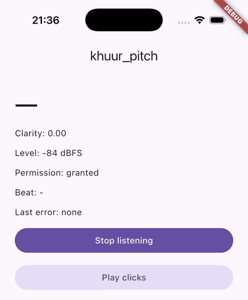

# khuur_pitch

[](https://pub.dev/packages/khuur_pitch)

Microphone pitch tracking for Flutter tuner apps, on iOS and Android.

The plugin captures mono audio natively and detects pitch in pure Dart with
YIN. It was written for a tuner for the morin khuur, the Mongolian horse-head
fiddle, and nothing in it is specific to that instrument.



The example app on an iPhone simulator, reading an F3 and then an A♯3
played to the microphone.

## What you get

- `MicPitchSource` streams about 47 `PitchFrame`s a second at 48 kHz. Each
  frame has the pitch in Hz, a clarity from 0 to 1 and the level in dBFS.
- `AudioCapture` streams the raw PCM if you want to analyse it yourself.
- The detector has no native code and no dependency besides Flutter.

## Setup

| | Requirement |
|---|---|
| iOS | 15.0 or later, with Swift Package Manager, which Flutter turns on by default. There is no podspec, so an app that turned it off cannot use the plugin. |
| Android | `minSdk` 24 or later. |

On iOS, add the reason you use the microphone to `ios/Runner/Info.plist`:

```xml
<key>NSMicrophoneUsageDescription</key>
<string>Listens to your instrument to show its pitch.</string>
```

On Android the plugin declares `RECORD_AUDIO` itself.

### What listening does to the audio session

On iOS the plugin sets the shared `AVAudioSession` to the `.record` category
in `.measurement` mode while it listens, and deactivates the session when the
stream is cancelled. Other audio stops for that time, your own app's
included. To play sound, cancel the stream first and set your own category.
The plugin restarts capture after an interruption such as a phone call, and
after a route change such as plugging in headphones.

On Android it reads the `UNPROCESSED` audio source where the device has one
and `VOICE_RECOGNITION` elsewhere, so the signal has no gain control or noise
suppression.

## Reading pitch

```dart
import 'package:khuur_pitch/khuur_pitch.dart';

final source = MicPitchSource();

if (await source.requestPermission() == MicPermission.granted) {
  final subscription = source.frames().listen((frame) {
    final hz = frame.hz;
    if (hz != null) print('$hz Hz, clarity ${frame.clarity}');
  });

  // Cancelling stops the microphone.
  await subscription.cancel();
}
```

`requestPermission` shows the OS prompt while the OS still allows it.
`checkPermission` never prompts. After `MicPermission.permanentlyDenied` only
`openAppSettings` helps.

`frame.hz` is null when the window is not periodic enough to name a pitch.
A frame is one analysis window, not one note. Voices and room noise produce
pitched frames too, so a tuner should wait for several frames that agree
before it shows a reading.

Capture failures arrive on the stream as a `PlatformException` whose code is
`permissionDenied`, `noInput` or `audioFailed`.

### Range

The tracker looks for pitches from 60 to 1400 Hz by default, which is B1 to
F6. Pass your own range to follow another instrument:

```dart
final source = MicPitchSource(
  tracker: PitchTracker(minHz: 30, maxHz: 400),
);
```

A tone outside the range gives a null `hz`. It is never named as a note an
octave away.

The window is sized to hold 2.5 periods of `minHz`, so a lower `minHz` means
a longer window and slower frames. At 44.1 and 48 kHz the default range uses
a 2048-sample window with a 1024-sample hop, and a `minHz` of 30 uses 4096
and 2048.

Precision falls as the pitch rises, because a high note's period is only a
few samples long. On a clean tone at 48 kHz the worst error is about 0.3
cents at 660 Hz and 2.6 cents at 1320 Hz.

### Threshold

`PitchTracker(threshold: 0.15)` is how much aperiodic power a pitched window
may hold. A pitched frame's clarity is always above 1 minus the threshold.
Lower it to drop noisier windows, raise it to keep them.

### Your own audio

`PitchTracker.track` takes any `Stream<AudioChunk>`, so you can run it over a
file or a test signal without a microphone.

## Accuracy

`tool/eval.dart` scores the detector on a synthetic corpus and prints the
table below. The tones are 14 pitches within 100 cents of F3 and A♯3, at 44.1
and 48 kHz, plus a sweep from 60 to 600 Hz. These are not recordings of real
instruments.

| Group | What it is | Detected | Median error | 95th percentile |
|---|---|---|---|---|
| sine | A pure tone | 100% | 0.01 cents | 0.02 cents |
| bowed | 20 harmonics | 100% | 0.01 cents | 0.03 cents |
| bowed-weak | Fundamental 12 dB under the second harmonic | 100% | 0.01 cents | 0.04 cents |
| vibrato | 10 cents of vibrato | 100% | 0.46 cents | 0.69 cents |
| snr20 | Noise 20 dB under the tone | 100% | 0.15 cents | 0.45 cents |
| snr10 | Noise 10 dB under the tone | 100% | 1.29 cents | 3.67 cents |
| rumble | A DC offset and a 12 Hz sine on top | 100% | 0.19 cents | 0.48 cents |
| sweep | 60 to 600 Hz in 10 s | 100% | 0.09 cents | 0.36 cents |
| silence, noise | No pitch | 0% | | |

No group had an octave error. One window costs about 40 µs on a desktop JIT,
which is about 2 ms of CPU for each second of audio.

Run it yourself:

```bash
dart run tool/eval.dart
```

It also scores the McLeod pitch method (`tool/mpm_detector.dart`) on the same
corpus for comparison.

## Example

`example/` is a small app that shows the live pitch, clarity and level.

## License

MIT. See [LICENSE](LICENSE).
